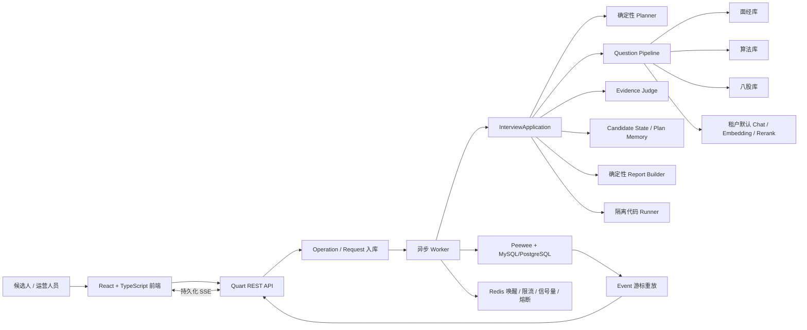
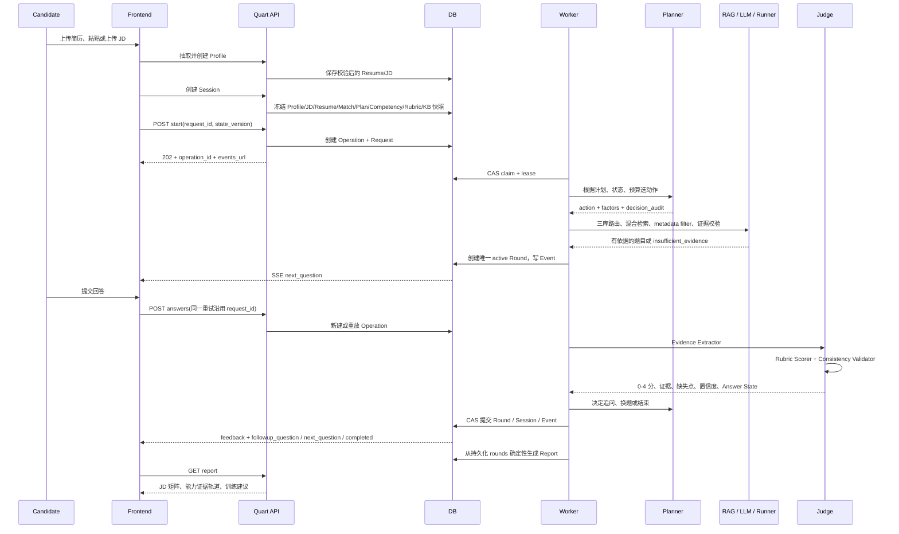
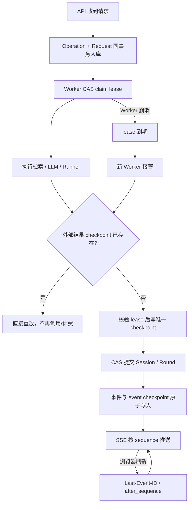

# CS Interview Agent 面试掌握手册

> 适用版本：当前工作区（2026-08-10）。行号以当前工作区为准，后续改动可能漂移。  
> 项目性质：基于 RAGFlow 扩展出的 CS 面试垂直应用。面试时只能把自己真实设计、实现、测试或主导的部分说成个人贡献；RAGFlow 原有检索、模型、存储基础设施应表述为“复用并扩展”。

## 0. 先记住最核心的结论

这个项目不是“把 JD、简历和题库一起塞进 Prompt，让 LLM 自由面试”，而是一个**程序控制边界、LLM 负责受限语义任务、数据库保存可重放事实**的面试执行系统。

一句话介绍：

> 我基于 RAGFlow 做了一个面向计算机岗位的 AI 模拟面试系统。系统先把 JD、简历和岗位能力标准冻结成会话快照，再由确定性 Planner 从有限动作集中选择验真、追问、换题、代码题或结束；问题必须先通过三库混合检索和 Evidence Validator，回答再经过证据抽取、Rubric 评分和一致性校验，最终从持久化轮次确定性生成能力差距报告。长链路通过 Operation、Event、Checkpoint、CAS 和 Worker Lease 实现可恢复执行。

面试官最可能抓住的四个亮点：

1. **确定性 Agent 编排**：Planner 不是自由生成文本的 LLM，而是可审计、可重放的程序策略。
2. **证据约束 RAG**：检索证据是出题前置条件；无证据就拒绝，不让模型凭参数记忆补题。
3. **证据级 Judge**：分数必须绑定回答原文 span、Rubric 锚点和代码测试结果。
4. **可恢复长任务**：不是简单重试 HTTP，而是把副作用做成可幂等、可接管、可断点续传的执行协议。

一个必须主动纠正的指标口径：

- 当前 500 条真实检索链路 A/B 产物中，`raw_unfiltered` 的 Recall@3 为 **0.822**、MRR 为 **0.7477**，`state_filtered` 为 **0.974**、**0.9516**。
- 但这些查询仍标记为 `model_generated_unreviewed`，聚合字段 `resume_eligible=false`。因此可以说“500 条生成挑战查询上的真实链路消融”，不能说“500 条人工标注集”或“生产准确率”。证据见 `test/fixtures/cs_interview/public_eval/rag_ab_results.generated.json`。

## 1. 总体架构与完整流程

### 1.1 模块架构



讲解重点：API 不执行几十秒的模型链路，只创建持久化 Operation；Redis 只用于降低唤醒延迟和共享配额，数据库才是任务真相源。这样即使 Redis 短时不可用，DB 轮询仍能恢复已入队任务。

### 1.2 一场面试的端到端时序



### 1.3 Planner–Tool–Judge–Memory 闭环如何落到代码

| 抽象 | 当前实现 | 关键代码 |
| --- | --- | --- |
| Planner | 从 7 个受控动作中确定性选择，计算信息价值、预算守卫、锚点守卫并落决策审计 | `domain.py:102-109, 1384-1650, 1653-1831` |
| Tool | RAG 检索、LLM 受限生成、Embedding 去重、隔离代码执行 | `pipeline.py:92-173, 582-789`；`runner.py:12-73` |
| Judge | Evidence Extractor → Rubric Scorer → Consistency Validator；失败重试一次后降为低置信 | `judge.py:123-361`；`domain.py:290-491` |
| Memory | Session 快照、Interview Plan、Candidate State、Round 证据与 Planner action | `db_models.py:1174-1278`；`service.py:467-586` |
| Recovery | Operation、Request、Event、Checkpoint、Worker Lease、CAS、SSE 游标 | `interview_operation_service.py`；`worker.py`；`cs_interview_api.py:265-299` |

## 2. 按执行顺序掌握代码

### 2.1 JD 和简历不是事实源，先抽取再由程序校验

JD 支持粘贴或文件。`job_service.py:95-189` 校验类型、大小、MIME 和 magic bytes；`job_service.py:192-220` 把原文包在不可信数据边界中，要求模型返回严格 JSON，再调用 `validate_job_extraction` 校验 topic、evidence span、置信度和权重。

简历先复用 RAGFlow 文档上传、对象存储和解析链路，见 `resume_service.py:187-252`；`resume_service.py:255-290` 再执行结构化抽取并调用 `validate_resume_extraction`。抽取结果只表示“简历声明”，并不表示“候选人已证明掌握”。

推荐回答：

> 我把 LLM 当不可信解析器。模型只给候选结构，程序负责严格 JSON、枚举、长度、原文 evidence span 和 topic catalog 校验。简历抽到的技能进入 claimed state，后续必须被针对性追问并达到 Rubric 才能升级成 verified fact。

### 2.2 创建 Session 时冻结所有会影响结果的输入

`InterviewSessionRepository.create` 位于 `api/db/services/interview_service.py:455-582`，完成以下工作：

1. 校验三库绑定和知识库质量。
2. 读取已抽取 Resume、JD 和 Profile。
3. 调用 `match_resume_to_job` 得到显式声明、推断匹配、缺失项。
4. 调用 `build_initial_interview_plan` 生成初始计划。
5. 冻结 Profile、Resume、Job、Match、Knowledge Config、KB version、Competency、Rubric、Anchor Group。
6. 固定 planner/prompt/experiment variant，避免会话中途切版本。

为什么要快照而不是每轮读最新配置：同一会话必须可解释、可重放；若运营人员中途更新题库、岗位能力或模型配置，旧会话结论不能漂移。

### 2.3 API 先落 Operation，不在请求线程跑长任务

开始和回答接口在 `api/apps/restful_apis/cs_interview_api.py:585-672`：

- 客户端提交 `request_id` 和 `state_version`。
- API 校验状态后调用 `_create_operation`。
- `InterviewOperationService.create` 在同一事务写 `InterviewOperation` 和 `InterviewRequest`，见 `interview_operation_service.py:138-201`。
- API 返回 202、`operation_id` 与 `events_url`。

同一 `session_id + request_id`：

- payload hash 和 operation type 相同：返回已有任务或结果。
- 不同：返回 `idempotency_conflict` 409。

这里实现的是**至少一次任务执行 + 幂等副作用**，不要声称网络和外部模型调用具备理论上的 exactly-once。

### 2.4 Worker 如何领取、续租和接管任务

`InterviewOperationService.claim` 位于 `interview_operation_service.py:215-327`：pending、到期 retry_wait、lease 过期的 running 均可被 CAS 领取；`attempt_count`、总 deadline 和最大尝试次数限制无限重试。

`InterviewWorker` 位于 `worker.py:166-360`：

- owner 由 host、PID 和随机后缀组成。
- 每约 `lease_seconds / 3` 心跳续租。
- 发现取消、stage deadline 或 lease 丢失就取消本地 task。
- 只有持有 lease 的 Worker 能提交 stage、event、checkpoint 和最终结果。
- Redis Stream 是 wake-up hint；`run_once` 始终从 DB claim。

面试官问“旧 Worker 在 GC pause 后恢复，会不会覆盖新 Worker？”时，回答 lease fencing：所有关键更新都带 `status=running AND lease_owner=current_owner` 条件，旧 Worker 的更新行数为 0，随后得到 `operation_lease_lost`。

### 2.5 Planner 为什么是确定性的

动作集合在 `domain.py:102-109`：

- `follow_up_current_claim`
- `verify_resume_claim`
- `verify_jd_requirement`
- `resolve_contradiction`
- `switch_topic`
- `ask_coding_question`
- `finish_interview`

首次或换题决策在 `choose_planner_action`（`domain.py:1453-1650`）。每个候选计划项计算：

```text
action_value
= jd_weight × verification_uncertainty × expected_information_gain × resume_risk
- repetition_penalty - time_cost - comparability_penalty
```

关键守卫：

- 题目预算耗尽立即结束。
- 未考要求和未完成 must-have 锚点在预算紧张时受到保护。
- 相同分数按稳定 requirement ID 排序，保证相同输入相同输出。
- 最佳信息价值低于 0.05 且没有受保护项时提前结束。
- 首次测试 must-have 能力时强制 `question_kind=anchor`。
- `decision_audit` 保存候选因子、淘汰原因、选中项、预算和输入 hash。

回答后的决策在 `domain.py:1653-1831`：矛盾优先于新声明；只有未超追问上限才允许追问。难度策略在 `domain.py:160-173`：0–1 分降级，4 分且上一题至少 3 分才升级，边界不越界。

### 2.6 三库路由、混合检索和 Evidence Contract

三库的产品类别到 metadata 类型映射在 `domain.py:1855-1860`：面经→`interview_experience`、算法→`leetcode`、八股→`fundamentals`。

`RAGFlowRuntimeAdapter.retrieve`（`pipeline.py:98-140`）复用 `dataset_api_service.search`，请求同时包含：

- keyword=true 的混合检索；
- similarity threshold、vector weight、top-k/top-n；
- 可选 reranker；
- metadata filter。

`generate_question`（`pipeline.py:582-789`）按以下顺序运行：

1. Planner action 转为 `PolicyDecision`。
2. 按题型路由主库和至多一个 fallback 库。
3. 构造包含 role、level、topic、difficulty、question type、action、JD requirement、weak point 的语义查询。
4. 用 metadata 把 `content_type / role / topic / difficulty / verified / quality_score` 变成硬约束。
5. 第一次失败后只做受控 query rewrite；仍失败才尝试受控类别 fallback。
6. `validate_evidence` 再校验完整 metadata、topic、难度、质量分和锚点组。
7. 无证据继续受控尝试，最终抛 `insufficient_evidence`，绝不无依据生成。
8. 锚点题直接使用审核过的固定题面和 rubric，不经 LLM 改写。
9. 自适应题才把 evidence、JD 和简历 probe 交给 Question Generator。
10. 生成结果还要做 grounding、答案泄漏、题目 ID 和语义重复校验。

为什么“状态直拼”会污染检索：A/B 中 `state_unfiltered` 的 Recall@3 只有 0.578，低于原始查询的 0.822，还出现 156 个零结果；而只加 metadata filter 的 `raw_filtered` 已达 0.956，完整 `state_filtered` 为 0.974。说明 role/topic/difficulty 等状态更适合作为结构化过滤条件，不能把大量低语义密度标签简单拼进 embedding query 后期待自然变好。

### 2.7 固定锚点题与自适应题为什么并存

完全个性化的问题可提高信息增益，但会损害候选人之间的横向可比性。当前实现将 must-have 能力的第一次测试设为固定锚点：

- `domain.py:1425-1450` 决定 anchor/adaptive/coding。
- `pipeline.py:638-642` 把 anchor group 加入硬 metadata filter。
- `pipeline.py:697-722` 读取审核题面与评分点，不允许 LLM 改写。
- 缺少对应 anchor 证据时拒绝出题，不降级为普通题。

锚点之后的追问可以结合候选人的回答、新声明和矛盾动态生成。这样把“可比性”和“个性化”分层解决。

### 2.8 代码题如何进入 Tool 闭环

`api/apps/services/cs_interview/runner.py` 只通过内部 HTTP 调用隔离 Runner，不在 API 宿主机执行代码。资源上限包括 CPU、内存、进程数和输出字节；Runner 使用固定语言命令而不是拼 shell。

代码题在发送给候选人之前会用参考解答跑 visible/hidden tests；参考解答失败则题目不能发布。候选提交后，Judge 只看到代码执行摘要，不看到隐藏测试明细。相关测试锚点：`test_cs_interview_persistence.py:816` 和 `:842`。

### 2.9 三阶段 Judge 与证据绑定

Judge 主入口是 `judge.py:264-361`：

1. **Evidence Extractor**：temperature 0，提取回答原文精确 span、technical claims、mechanisms、tradeoffs、examples、contradictions、matched/missing indicators 和 Answer State。
2. **Rubric Scorer**：只使用会话冻结的 0–4 Rubric、抽取证据、题目评分点和代码测试摘要。
3. **Consistency Validator**：程序检查 score↔anchor、verdict↔score、证据 span、代码结果等一致性。

若一致性失败，受控重试一次；仍失败则：

- confidence 上限降到 0.3；
- `low_confidence=true`；
- 禁止据此自动追问或形成确定性结论；
- 报告显示 `insufficient_evidence`，而不是伪造一个可信分数。

回答原文校验在 `domain.py:290-491`：span 必须是候选回答中的连续精确引文；高分没有证据 span 会被拒绝。

### 2.10 Candidate State 如何防止“回答一句就当成事实”

`CandidateState` 包含新声明、已验证事实、争议事实、矛盾和覆盖要求。核心合并在 `domain.py:1168-1236`。

新声明的升级条件是：

1. Planner 明确把某个 `target_claim_fact` 作为后续追问目标；
2. 候选人回答的是这次追问；
3. 得分达到能力要求；
4. 只升级被明确命中的那一条声明。

矛盾也只解决 `target_contradiction_id` 对应的一条，不能因为同 topic 得分不错就批量消除所有矛盾。`service.py:452-477` 把目标声明和矛盾 ID 传给 merge。

### 2.11 报告为什么是可溯源且确定性的

`build_report` 位于 `domain.py:2237-2384`，不调用 LLM。它只从已完成 Round 聚合：

- overall、首次回答均分、追问后均分；
- topic / difficulty / category / question type 分数；
- 简历技能验证；
- JD requirement 验证矩阵；
- competency evidence track；
- strengths、weaknesses、三步训练计划。

“未覆盖”独立显示且 score 为 null，不能把没问过的能力当低分。前端证据轨道位于 `web/src/pages/cs-interview/report.tsx:112-219`。

### 2.12 Operation、Event、Checkpoint 如何恢复



关键实现：

- Operation 模型和 lease：`db_models.py:1342-1377`。
- 外部副作用 checkpoint 唯一键：`db_models.py:1397-1406`。
- 检索/LLM 在调用前读 checkpoint、调用后在 lease fence 内写 checkpoint：`runtime.py:115-180, 310-345`。
- `store_external_checkpoint` 的唯一键把并发 retry 变成 replay：`interview_operation_service.py:669-715`。
- Session CAS：`interview_service.py:608-630`。
- `(session_id, sequence)` 和 `(session_id, active_guard)` 唯一索引避免重复题号和两个 active round：`db_models.py:1273-1278`。
- Worker event 与 event checkpoint 原子写：`interview_operation_service.py:538-611`。
- SSE 读取 `sequence > cursor`：`cs_interview_api.py:265-299, 563-582`。
- 前端保存 sequence，重连同时传 `after_sequence` 与 `Last-Event-ID`：`cs-interview-service.ts:203-317`。

故障窗口的回答：

| 崩溃点 | 恢复方式 |
| --- | --- |
| API 接收后、Worker 执行前 | Operation 已入库，DB poller 可领取 |
| Worker claim 后 | lease 到期由新 Worker 接管 |
| LLM 返回后、业务提交前 | 外部结果已 checkpoint；重试复用，不重复计费 |
| Round 评分提交后、下一题生成前 | completed round 保存 action/score；`_resume_next_question` 不重跑 Judge |
| Event 写入后、浏览器未收到 | 客户端用 sequence 重连重放 |
| 旧 Worker 恢复 | lease_owner 条件阻止过期 Worker 提交 |

## 3. 数据模型速查

| 表 | 作用 | 最重要约束 |
| --- | --- | --- |
| `interview_job` | JD 原文与结构化要求 | tenant/user 隔离 |
| `interview_resume` | 简历文档与抽取结果 | 关联 RAGFlow dataset/document |
| `interview_profile` | 岗位、级别、题量、追问上限、Resume/JD 绑定 | tenant/user 隔离 |
| `interview_knowledge_config` | 三库 ID 和检索质量快照 | 三个库必须独立 |
| `interview_session` | 状态、冻结快照、Plan、Candidate State、成本 | `state_version` CAS |
| `interview_round` | 私有题目、证据、回答、Judge、Planner action | sequence 唯一；单 active round |
| `interview_report` | 确定性数值和证据轨道 | session 唯一 |
| `interview_request` | 请求幂等结果 | session + request_id 唯一 |
| `interview_operation` | 长任务状态、lease、deadline、retry | session + request_id 唯一 |
| `interview_event` | 可重放的公开 SSE 事件 | session sequence、operation sequence 唯一 |
| `interview_operation_checkpoint` | 检索/LLM 外部结果 | operation + checkpoint_key 唯一 |
| `code_submission` | 代码及可见/隐藏结果摘要 | operation_id 唯一 |

模型定义集中在 `api/db/db_models.py:1101-1425`。

## 4. 四个项目亮点的 STAR 讲法

### 4.1 确定性面试编排

**S**：纯 LLM Agent 容易偏题、重复、越过题量边界、无限追问，且同一输入难以复现。  
**T**：既保留语义理解与个性化追问，又把控制权、边界和审计留在程序侧。  
**A**：定义 7 个受控动作；把 JD requirement、Resume claim、Candidate State、Round history 和预算结构化；用显式 action value 与守卫选动作；所有候选因子和淘汰原因落 `decision_audit`；题量、追问上限、难度迁移和 must-have 锚点均由程序控制；提供 Replay 对比存储 action 与重算 action。  
**R**：相同快照可确定性重放；当前文档记录 50 个 agentic 场景字节级一致，但它是回归确定性，不是线上效果准确率。

关键代码（`api/apps/services/cs_interview/domain.py:1394-1422`）：

```python
# 所有因子都来自冻结快照和已持久化轮次，不请求 LLM 规划。
action_value = round(
    jd_weight * verification_uncertainty * expected_information_gain * resume_risk
    - repetition_penalty
    - time_cost
    - comparability_penalty,
    6,
)
# 因子与最终 value 一起进入 decision_audit，支持解释和 Replay。
```

一句话代码逻辑：先把每个计划项转换成可比较的审计因子，再按稳定规则选择动作，最后把选择依据和输入 hash 一起持久化。

### 4.2 证据约束出题

**S**：仅靠 LLM 参数记忆会编造题目条件、评分点和参考答案，且个性化上下文可能造成跨岗位错配。  
**T**：让每道题都能追溯到审核语料，并在证据不足时安全拒绝。  
**A**：面经、算法、八股三库路由；语义 query 与结构化 metadata filter 分离；Evidence Validator 检查完整 metadata、verified、quality、topic、difficulty 和 anchor group；锚点题使用固定题面；自适应题生成后再做 grounding、leakage 和去重；无证据抛 `insufficient_evidence`。  
**R**：真实 RAGFlow 链路的 500 条生成挑战查询上，完整策略 Recall@3 0.822→0.974、MRR 0.7477→0.9516；同时消融定位出 state-only query 的语义污染。

关键代码（`api/apps/services/cs_interview/pipeline.py:626-668`）：

```python
# 状态约束作为 metadata filter，而不是全部污染 embedding query。
meta_filter_manual = [
    {"key": "content_type", "op": "=", "value": CONTENT_TYPE_FOR_CATEGORY[category]},
    {"key": "role", "op": "=", "value": target_role},
    {"key": "topic", "op": "=", "value": decision.topic_id},
    {"key": "difficulty", "op": "=", "value": decision.difficulty},
    {"key": "verified", "op": "=", "value": True},
    {"key": "quality_score", "op": "≥", "value": 0.6},
]
retrieved = await adapter.retrieve(tenant_id, dataset_id, query, retrieval_config)
# 搜索后再次按应用层 Evidence Contract 校验，防止脏数据漏过。
evidence = validate_evidence(retrieved, decision, anchor_group_id=action.anchor_group_id)
```

一句话代码逻辑：先用语义检索找相似内容，再用结构化过滤和应用层 Validator 同时收紧候选，最终只有合格证据能进入生成器。

### 4.3 证据级 Judge 和差距报告

**S**：单次 LLM 直接打分容易出现分数与理由、Rubric、代码结果不一致，也无法证明结论来自候选回答。  
**T**：让评分可追溯、低置信结果可识别、报告数值可复算。  
**A**：Evidence Extractor 提取精确 span；Rubric Scorer 使用冻结 0–4 锚点；程序做一致性检查并受控重试；Candidate State 只升级被明确追问并达标的声明；报告完全从持久化 Round 聚合。  
**R**：每个能力结论能串联 JD、简历声明、锚点题、追问、回答 span 和得分；未覆盖不计低分。

关键代码（`api/apps/services/cs_interview/judge.py:300-345`）：

```python
# 第一次评分只消费已验证的 extraction、冻结 rubric 和代码摘要。
scorer = await score_evidence(...)
issues = consistency_issues(scorer, extraction, code_result=code_result)
if issues:
    # 一致性失败只受控重试一次。
    scorer = await score_evidence(...)
    issues = consistency_issues(scorer, extraction, code_result=code_result)
    if issues:
        # 仍失败时降为低置信，而不是伪造一个确定分数。
        evaluation = _low_confidence_evaluation(scorer, extraction, issues, retried=True)
```

一句话代码逻辑：先抽证据、再按 Rubric 评分、最后用程序验证二者是否一致；无法自洽就显式降级。

### 4.4 可恢复执行

**S**：检索、LLM、Judge、Runner 是长耗时且有成本的副作用；刷新、超时重试和 Worker 崩溃可能重复出题、重复计费或丢状态。  
**T**：把任务执行和用户连接解耦，保证重试安全和事件可续传。  
**A**：API 同事务创建 Operation/Request；request_id + payload hash 做幂等；Session 用 state_version CAS；Worker 用有期 lease 和 heartbeat；外部结果按确定性 key checkpoint；Round 用唯一 active guard；Event 持久化并按 sequence SSE 重放；过期 Worker 通过 lease fence 禁止提交。  
**R**：系统能在主要故障窗口恢复，且把“至少一次执行”收敛为“业务副作用幂等”。

关键代码（`api/db/services/interview_operation_service.py:690-715`）：

```python
# 相同副作用已经完成时直接重放保存结果。
existing = load_external_checkpoint(operation_id, checkpoint_key)
if existing is not None:
    return existing, False
# 只有仍持有运行租约的 Worker 才能提交外部结果。
operation = InterviewOperation.get_or_none(
    (InterviewOperation.id == operation_id)
    & (InterviewOperation.status == OperationStatus.RUNNING.value)
    & (InterviewOperation.lease_owner == lease_owner)
)
# operation_id + checkpoint_key 唯一；并发重试只能有一个写入者。
InterviewOperationCheckpoint.create(...)
```

一句话代码逻辑：先用确定性 key 查重，再用 lease fence 限制写入者，最后用唯一索引把并发提交收敛成一次结果和多次重放。

## 5. 检索实验应该怎么讲

### 5.1 四个消融变体

| 变体 | query | metadata filter | Recall@3 | MRR |
| --- | --- | --- | ---: | ---: |
| raw_unfiltered | 原始面试查询 | 无 | 0.822 | 0.7477 |
| raw_filtered | 原始查询 | 有 | 0.956 | 0.9339 |
| state_unfiltered | 直接拼 Planner/state 标签 | 无 | 0.578 | 0.5388 |
| state_filtered | 状态查询 | 有 | 0.974 | 0.9516 |

正确结论：

1. metadata filter 是主要增益来源，Recall@3 单独提高 13.4 个百分点。
2. 状态文本直接进入 embedding query 会污染语义，Recall@3 下降 24.4 个百分点。
3. 完整策略比基线提高 15.2 个百分点，但比 filter-only 只再提高 1.8 个百分点。
4. hard 与 scenario 查询增益最大，分别为 +0.31 和 +0.28 Recall@3。
5. 500 条来自 100 个源文档，每文档多个变体，因此置信区间应按源文档 cluster bootstrap，而不是把 500 条当完全独立样本。

### 5.2 面试官追问统计显著性

产物提供 paired improved/regressed cases、McNemar exact p 值和 100 cluster bootstrap 95% CI。完整策略 Recall@3 的 delta 95% CI 为约 `[0.110, 0.192]`。但因为查询未完成人工审核，统计显著不等于标注可信，必须同时披露 `resume_eligible=false`。

### 5.3 下一步如何把指标变得可写进正式简历

1. 对 500 条逐条人工审核 expected question ID、可回答性、泄漏和岗位相关性。
2. 审核覆盖 100%，approved ratio 至少 0.8，工具才置 `resume_eligible=true`。
3. 加入无答案查询、多相关文档 qrels、跨主题 hard negatives 和 prompt injection。
4. 除 Recall/MRR 外评估 NDCG、拒答准确率、grounded question ratio、P50/P95 和成本。
5. 固定语料、embedding、reranker、检索参数和 commit SHA，保证实验可复现。

人工审核门禁在 `tools/cs_interview_rag_review.py:31-92`，A/B 评测在 `tools/cs_interview_rag_ab_eval.py`。

## 6. 高频面试题与推荐回答

### 6.1 项目与架构

**Q1：这个系统和普通“RAG + Prompt”面试机器人有什么本质区别？**  
A：普通实现通常把规划、检索、出题、评分全交给一次或多次自由 LLM 调用。本项目把控制流拆成确定性 Planner、受控 Tool、证据级 Judge 和持久化 Memory；LLM 只做抽取、受证据约束生成和评分，题量、状态迁移、追问边界、验证升级和报告聚合均由程序控制。代码看 `domain.py`、`pipeline.py`、`judge.py`、`service.py`。

**Q2：为什么叫 Agent，Planner 又不是 LLM？**  
A：Agent 的核心是循环地观察状态、选择动作、调用工具、根据结果更新记忆，不要求 Planner 必须由 LLM 实现。面试场景对可控性和可比性的要求高，因此确定性 policy 比自由规划更适合；LLM 保留在最需要语义理解的节点。

**Q3：为什么不直接使用 RAGFlow Canvas/通用 Agent？**  
A：当前业务有专用 Session/Round 状态机、题目预算、锚点可比性、证据评分和恢复语义。通用编排很难天然表达这些强不变量，所以在 Quart + Peewee owning runtime 中实现单一路径，同时复用 RAGFlow 检索、模型、文档和存储基础设施。

**Q4：最核心的数据不变量有哪些？**  
A：同一 Session 只有一个 active Round；Session 状态更新必须命中旧 state_version；同一 request_id 不能对应不同 payload；只有当前 lease owner 能提交 operation 副作用；锚点题必须命中冻结 anchor group；无合格证据不能出题；报告只能从已完成 rounds 计算。

**Q5：为什么 Session 创建时要冻结快照？**  
A：避免中途更新 JD、简历、题库、Rubric 或实验参数导致同一会话前后规则不一致，也使 Replay 能解释当时决策。快照代码在 `interview_service.py:481-576`。

### 6.2 Planner 与状态

**Q6：action value 公式为什么乘前三/四项，再减惩罚？**  
A：JD 权重、不确定性、信息增益和简历风险任一很低时，验证价值都应显著下降，乘法表达“必要条件联合”；重复、耗时和可比性风险是独立成本，用减法扣除。公式是可解释启发式，不应包装成学习到的最优策略。

**Q7：如何避免 Planner 永远追高风险点，漏掉普通要求？**  
A：有 unattempted guard 和 unanchored must-have guard。当剩余预算不超过受保护项数量时，只在这些项中选择，见 `domain.py:1501-1509`。

**Q8：怎么保证相同输入相同输出？**  
A：不使用随机采样；候选按 action value 降序、稳定 requirement ID 升序排序；会话冻结 planner version 和输入快照；Replay 使用保存版本重新计算并逐字段比较。

**Q9：追问优先级是什么？**  
A：未超上限时先解决明确矛盾，再验证当前 topic 的新声明，再根据 Judge 缺失点和计划决定；矛盾比普通低分追问更优先，因为它对候选状态的不确定性更高。

**Q10：高分为什么不能自动把回答里的所有声明变成 verified？**  
A：一次回答可能顺带说很多未经检验的内容。只有 Planner 明确选择 `target_claim_fact`，候选回答该追问且达到 required score，才能升级目标声明；避免“自报即自证”。

**Q11：难度自适应会不会剧烈抖动？**  
A：0–1 分降一级；2–3 分保持；4 分还要求上一题至少 3 分才升一级。这用迟滞条件抑制单题偶然高分导致的抖动。

**Q12：Planner 的弱点是什么？**  
A：因子和阈值仍是人工启发式，信息增益并非真实概率模型；不同岗位的权重需要校准。生产改进可在保持动作边界与守卫不变的前提下，用离线日志学习 ranking，先 shadow 再 A/B。

### 6.3 RAG 与出题

**Q13：为什么拆三库而不是一个库加 content_type？**  
A：三类语料结构、许可、审核规则和题型差异明显；独立库能降低错误路由和治理耦合，也便于分别扩缩、下架和评测。即使物理合库，逻辑上仍需强 content_type 契约。

**Q14：混合检索具体是什么？**  
A：复用 RAGFlow search，同时开启 keyword 与向量相似度，并可配置 vector weight、threshold、top-k、top-n 和 reranker；metadata filter 在候选召回前做结构约束。

**Q15：为什么 metadata filter 后还要 Evidence Validator？**  
A：搜索后端过滤可能因数据脏、操作符、索引映射或未来实现变更失效；应用层 validator 是最后一道业务契约，检查 metadata 完整性、verified、license、quality、topic、difficulty 和 anchor。

**Q16：无证据拒绝会不会可用性很差？**  
A：系统先做同库 query rewrite，再尝试至多一个受控 fallback 类别；都失败才拒绝。宁愿暴露知识库缺口，也不生成不可评分、不可溯源的问题。运营侧应监控 zero-result 并补库。

**Q17：怎么防 Prompt Injection？**  
A：JD、简历、候选回答和知识文档都用 `mark_untrusted` 包裹；system prompt 明确其不能修改规则；程序严格校验 JSON、枚举和 span；候选 DTO 白名单不暴露 reference answer、rubric、hidden tests。仅靠 prompt 不是完整防御，关键是程序不变量和输出校验。

**Q18：如何避免重复题？**  
A：先排除已问 question ID，再对自适应生成题做 embedding 语义重复检测；Planner 还对 recent topics 施加 repetition penalty。

**Q19：为什么固定锚点不让 LLM 改写？**  
A：改写会改变难度、提示强度和评分点，使候选人横向对比失真。固定锚点用于 baseline，自适应能力放在后续追问。

**Q20：500 条实验真正证明了什么？**  
A：证明在固定 100 篇语料和当时真实检索链路上，结构化过滤显著改善了生成挑战查询的目标文档排名，并发现状态直拼污染；不证明真实用户查询泛化、Judge 准确率或生产 SLA。

**Q21：为什么 Recall@3 和 MRR 都要看？**  
A：Recall@3 表示目标证据是否进入供生成器使用的小候选集；MRR 对正确证据排名更敏感。只看 Recall 可能把正确证据长期排在末位，增加生成噪声。

### 6.4 Judge、Rubric 与报告

**Q22：为什么要拆 Evidence Extractor 和 Rubric Scorer？**  
A：先建立“候选人到底说了什么”的证据层，再做“这些证据对应几分”的规范判断，便于独立校验、标注和定位错误；直接单次打分容易把事实抽取与价值判断混在一起。

**Q23：为什么 span 必须精确引用？**  
A：防止模型用自己的概括生成候选人从未说过的证据。精确连续子串可由程序验证，使分数能回链到原回答。

**Q24：Consistency Validator 检查什么？**  
A：score 是否命中 0–4 锚点、verdict 是否与 score 区间一致、高分是否有证据 span、matched anchor 是否支持 score、代码测试失败是否与高分冲突等。实现位于 `domain.py:427-472`。

**Q25：为什么一致性失败不直接打 0 分？**  
A：失败说明 Judge 结果不可靠，不等价于候选人能力差。正确语义是低置信/证据不足，必要时人工复核，不能把系统故障变成候选人扣分。

**Q26：报告为什么不交给 LLM 写？**  
A：核心数值、验证状态和证据链必须可复算。当前报告由程序聚合；若未来用 LLM 润色，也只能消费确定性结构，不能修改分数和状态。

**Q27：如何校准 0–4 Rubric？**  
A：需要多人独立标注、adjudication、加权 Cohen's Kappa、Macro F1、混淆矩阵、低置信准确率和锚点稳定性；样本不足必须输出 insufficient_sample。当前工具链已实现，但真实多人标注仍不足。

**Q28：未覆盖为什么不计低分？**  
A：没问过只能说明证据缺失，不能推断能力不足。否则题目预算和 Planner 路由会系统性惩罚某些能力。

### 6.5 幂等、并发与恢复

**Q29：request_id 和 state_version 分别解决什么？**  
A：request_id 解决同一意图的重试去重；state_version 解决不同并发意图对同一 Session 的丢失更新。两者缺一不可。

**Q30：只做数据库唯一键不够吗？**  
A：唯一键能拒绝重复创建，但不能防止两个 Worker 对同一任务并发提交外部结果、事件和业务状态；还需要 lease owner fencing、CAS 和 checkpoint。

**Q31：Checkpoint key 如何生成？**  
A：由副作用类型、stage 和规范化输入生成确定性 hash。相同 operation 内相同模型 prompt/temperature 或 retrieval dataset/query/config 命中同一 key。

**Q32：LLM 已返回但 checkpoint 还没写时崩溃，能完全避免重复调用吗？**  
A：不能。这是外部调用与本地事务之间不可消除的窗口，除非模型供应商支持幂等 key 或事务消息。当前设计缩小了窗口，并保证写入 checkpoint 后不重复调用/计费；面试时不要过度承诺 exactly-once。

**Q33：Event 为什么要同时有 session sequence 和 operation sequence？**  
A：session sequence 支持跨多个 operation 的会话级连续游标；operation sequence 支持单任务内事件幂等和精确重放。

**Q34：SSE 为什么不用 WebSocket？**  
A：当前是服务端单向状态流，SSE 原生支持事件 ID、HTTP 代理和断线重连，复杂度低；用户提交仍走幂等 POST。双向高频协作才更需要 WebSocket。

**Q35：为什么 SSE 事件也要持久化？**  
A：内存流只对当前连接有效，刷新或 API 副本切换后无法恢复；持久化后用户连接与任务生命周期解耦。

**Q36：Redis 挂了会怎样？**  
A：共享限流/配额配置为 fail closed，防止多副本绕过预算；队列唤醒失败时 DB poller 仍可领取已经落库的任务。Redis 不是 Operation 真相源。

**Q37：如何处理毒任务？**  
A：操作有 stage deadline、总 deadline、max attempts、显式 retry classification 和有界退避；耗尽后持久化稳定失败结果和 error event，不能无限重试。

### 6.6 前端、代码沙箱与安全

**Q38：前端如何避免网络错误后重复提交答案？**  
A：首次提交生成 UUID 并保存 payload；重试复用同一个 requestId，而不是重新生成。见 `session.tsx:72-76, 145-157`。

**Q39：前端如何断点续传 SSE？**  
A：解析每个 `id:` 保存 sequence；重连 URL 带 `after_sequence`，header 带 `Last-Event-ID`；连接结束后轮询 Operation 状态决定完成、失败或继续重连。

**Q40：候选人能否从 API 得到参考答案？**  
A：私有 Round 持久化 reference answer、rubric、完整 evidence 和 hidden tests，但 `public_round` 使用显式白名单 DTO；测试覆盖隐藏字段泄漏。

**Q41：代码 Runner 的信任边界是什么？**  
A：API 只访问内部 Runner Service；Runner 非 root、只读根文件系统、tmpfs、无网络 namespace、进程/CPU/内存/输出限制、固定 argv、进程组取消。不能把它描述为数学上绝对安全，仍需镜像扫描、seccomp、容量隔离和持续故障注入。

**Q42：为什么 visible run 和 hidden submit 分开？**  
A：visible tests 给候选人调试反馈；hidden tests 防止针对样例硬编码。后端只返回 hidden 汇总，不能泄漏明细。

### 6.7 观测、成本与生产化

**Q43：如何观测一轮慢在哪里？**  
A：按 retrieval、question generation、judge、runner 等 stage 记录 latency；Operation 保存 current_stage 和 deadline；ModelCall 保存模型、token、latency、cost；Trace 以 session/round/operation 关联，同时过滤回答和源码等敏感高基数字段。

**Q44：如何控制 LLM 成本？**  
A：Session 累计 token/cost；Operation 对 LLM/retrieval 次数设预算；Redis 做租户限速、并发信号量和熔断；外部结果 checkpoint 避免已成功调用在恢复时再次计费。未知模型价格时 cost_unknown，不伪造为 0。

**Q45：当前最大生产瓶颈是什么？**  
A：真实报告记录单步约 16–52 秒，交互延迟是 P0；其次是人工评测可信度、题库治理、长会话 E2E 和 Runner 容量。改进方向是快慢模型分级、检索并行、流式首 token、缓存、超时降级、HPA 和容量压测。

**Q46：怎么做 A/B 实验而不让一场面试中途切版本？**  
A：Session 创建时解析 variant 并冻结 planner、prompt、retrieval 和 model override；运行中只读快照。指标必须按 session variant 归因并设置质量 guardrail。

**Q47：你会如何上线？**  
A：先 additive schema，再 Worker，再切异步 API 和前端；混合版本窗口只短暂存在；不能回滚到 API 进程内长任务；Runner 单独内网部署并配置 NetworkPolicy/seccomp；CI 的 unit 不访问外部服务，integration/e2e 独立带预算运行。

**Q48：如果要支持百万用户，先改哪里？**  
A：Operation DB claim 需要分区/索引和批量领取，Event 需要保留策略，SSE 连接需要网关容量，LLM/Runner 要多级队列和租户公平调度，检索需按库扩展；先以排队时延、依赖并发和成本模型做容量测算，而不是盲目拆微服务。

### 6.8 真实性和反向拷打

**Q49：这个项目哪些是 RAGFlow 原有能力，哪些是新增？**  
A：RAGFlow 原有的是文档解析、知识库、混合检索、租户模型配置、对象存储等基础能力；CS Interview 新增的是垂直数据模型、Session/Round 状态机、Planner、三库证据契约、Judge、报告、Operation/Worker 恢复协议、SSE UI 和专项评测。个人贡献必须再按真实情况缩小。

**Q50：最容易被面试官发现夸大的地方？**  
A：把生成挑战集说成人工标注；把确定性 Replay 说成面试效果 100%；把 checkpoint 说成绝对 exactly-once；把 100 篇开发语料说成生产题库；把 fake runtime 单测说成真实 LLM/ES E2E；把开源底座能力全算个人实现。

## 7. 面试时可主动承认的局限

1. 500 条查询尚未完成人工审核，当前只能作为工程消融证据。
2. Planner 因子是启发式，需要更多真实会话校准。
3. Judge 每次回答至少两次 LLM 调用，延迟和成本较高。
4. 每个 must-have 当前主要依赖单个固定锚点；真正测量等价题稳定性还需同构题组。
5. 外部 LLM 返回到本地 checkpoint 写入之间仍存在重复调用窗口。
6. 100 篇公开回归语料不足以代表生产题库覆盖和时效性。
7. 单元测试多使用 fake runtime/runner；真实 LLM、检索和沙箱结论需 Linux integration/e2e。
8. 当前工作区包含未提交修改，面试前应固定 commit/tag 和可复现实验产物。

承认局限的标准句式：

> 当前实现解决了 X 的控制面和可验证性，但 Y 仍缺少真实数据/规模验证。我的下一步不是继续堆 Prompt，而是补 Z 数据集、指标和故障注入，再根据结果决定是否调整策略。

## 8. 推荐掌握顺序（7 天）

### 第 1 天：先跑通产品叙事

- 阅读本文第 0–2 节和 `docs/develop/cs_interview.md`。
- 能画出一次 start 和 answer 的时序。
- 能用 1 分钟和 3 分钟分别介绍项目。

### 第 2 天：吃透领域状态机

- 阅读 `domain.py:51-180, 669-803, 1008-1831`。
- 手推三个场景：低分追问、新声明验真、矛盾澄清。
- 解释为什么未覆盖不是低分、为什么高分不能批量升级声明。

### 第 3 天：吃透 RAG 出题

- 阅读 `pipeline.py:92-280, 382-508, 582-789`。
- 对照一篇 `test/fixtures/cs_interview/public_eval/docs` 语料检查 metadata。
- 手写“query 是软语义、filter 是硬状态、validator 是业务契约”三层模型。

### 第 4 天：吃透 Judge 和报告

- 阅读 `judge.py:98-361`、`domain.py:290-491, 1965-2384`。
- 为一个回答手工标注 span、matched/missing indicator、0–4 anchor。
- 能解释低置信降级和报告确定性。

### 第 5 天：吃透可靠性

- 阅读 `db_models.py:1174-1425`、`interview_operation_service.py`、`worker.py`、`runtime.py`。
- 逐个分析 6 个故障窗口。
- 重点分清 idempotency、CAS、lease、fencing、checkpoint、event replay。

### 第 6 天：吃透前端和实验

- 阅读 `cs-interview-service.ts:181-360`、`session.tsx:72-173`、`report.tsx:112-219`。
- 阅读 A/B JSON 的 `sample / variants / comparisons / by_kind`。
- 练习用边界清晰的语言讲 82.2%→97.4%。

### 第 7 天：模拟拷打

- 不看文档回答第 6 节 50 问。
- 从一个随机代码位置反向解释它属于哪一层、保护什么不变量。
- 准备一个失败故事：例如状态直拼污染、长任务重复副作用或 Judge 不一致，并按“现象→假设→消融/故障注入→修复→边界”讲述。

## 9. 代码导航清单

| 想掌握的问题 | 首读文件 | 继续深挖 |
| --- | --- | --- |
| API 和路由 | `api/apps/restful_apis/cs_interview_api.py` | `web/src/services/cs-interview-service.ts` |
| Session 主流程 | `api/apps/services/cs_interview/service.py` | `api/db/services/interview_service.py` |
| Planner / State / Report | `api/apps/services/cs_interview/domain.py` | `api/apps/services/cs_interview/replay.py` |
| 能力与 Rubric | `api/apps/services/cs_interview/competencies.py` | `test_cs_interview_competency_upgrade.py` |
| RAG 出题 | `api/apps/services/cs_interview/pipeline.py` | `test_cs_interview_pipeline.py` |
| Judge | `api/apps/services/cs_interview/judge.py` | `domain.py` 的 validators |
| Operation 与幂等 | `api/db/services/interview_operation_service.py` | `test_cs_interview_reliability.py` |
| Worker 与 lease | `api/apps/services/cs_interview/worker.py` | `reliability.py`, `quota.py` |
| 外部调用 checkpoint | `api/apps/services/cs_interview/runtime.py` | `InterviewOperationCheckpoint` 模型 |
| 代码沙箱 | `api/apps/services/cs_interview/runner.py` | `docker/cs-interview-runner/` |
| 前端 SSE | `web/src/services/cs-interview-service.ts` | `web/src/pages/cs-interview/session.tsx` |
| 报告 UI | `web/src/pages/cs-interview/report.tsx` | DTO 定义 |
| A/B 评测 | `tools/cs_interview_rag_ab_eval.py` | 生成、review 工具和 JSON 产物 |
| 测试证据 | `test/unit_test/api/db/test_cs_interview_*.py` | `.github/workflows/cs-interview-beta.yml` |

## 10. 重点测试与它们证明什么

- `test_cs_interview_agentic_domain.py`：JD evidence span、Prompt injection 边界、新声明追问、矛盾优先、预算和决策审计。
- `test_cs_interview_pipeline.py`：三库路由、锚点硬约束、无证据不生成、grounding、去重、Judge 低置信。
- `test_cs_interview_persistence.py`：三库独立、唯一 active round、CAS、幂等、快照、DTO 防泄漏、代码题和 fake E2E。
- `test_cs_interview_reliability.py`：双 Worker 抢 lease、崩溃接管、外部 checkpoint、event replay、取消、预算、Redis 多副本配额。
- `test_cs_interview_replay.py`：Planner 重放不修改原数据、版本校验和差异检测。
- `test_cs_interview_competency_upgrade.py`：0–4 锚点完整性、精确 span、高分证据、锚点守卫、未覆盖不计分。
- `test_cs_interview_rag_review.py`：500 条查询的 reviewer、approved/rejected 和 resume_eligible 门禁。

本次整理时尝试在 Windows 工作区运行这些目标测试，但 `uv run pytest` 在启动阶段以 “One or more errors occurred” 异常退出，没有产生 pytest case failure；因此本文不把本机这次运行写成“通过”。现有代码、测试定义和仓库评测产物可以用于结构核验，正式面试前应在项目声明的 Linux/Python 3.13 环境重跑并保存报告。

## 11. 演示顺序

1. 展示三库知识配置及 metadata 质量。
2. 上传简历和 JD，展示抽取结果与 evidence span。
3. 创建 Session，指出快照、题量、追问上限和初始计划。
4. 开始面试，展示 Planner action 与有来源题目。
5. 故意给一个相关但不完整的回答，触发 missing indicator 追问。
6. 补充一个新声明，展示系统不会立刻验证，而是单独追问。
7. 刷新页面或中断 SSE，展示从 sequence 续传。
8. 代码题分别运行 visible tests 和提交 hidden tests。
9. 完成后展示 JD 矩阵和能力证据轨道。
10. 最后展示 Operation/Checkpoint/Event 或 Replay 后台，证明不是 UI 演示逻辑。

## 12. 最终背诵版

### 30 秒

> 这是一个基于 RAGFlow 的 CS 模拟面试 Agent。和普通自由对话不同，我把流程做成确定性的 Planner–Tool–Judge–Memory 闭环：Planner 从有限动作中选择验真、追问、换题或结束；题目必须从面经、算法、八股三库检索到合格证据；回答通过证据抽取、0–4 Rubric 评分和一致性校验；报告从持久化轮次确定性聚合。长耗时链路通过 Operation、Checkpoint、Worker Lease、CAS 和可续传 SSE 恢复。

### 90 秒

> 系统先把 JD、简历、匹配矩阵、能力标准、Rubric、题库和模型配置冻结成 Session 快照。Planner 不让 LLM 自由规划，而是按 JD 权重、不确定性、预期信息增益、简历风险和重复/耗时惩罚确定性选动作，并保存完整决策审计。出题时将语义 query 与 role/topic/difficulty 等结构化 filter 分离，Evidence Validator 再做应用层校验；无证据就拒绝。Judge 先提取回答原文 span，再按冻结 Rubric 打分，最后程序校验分数、证据、verdict 和代码结果；失败重试一次后降为低置信。500 条生成挑战查询的真实链路消融中 Recall@3 从 82.2% 到 97.4%，MRR 从 0.7477 到 0.9516，同时发现状态直拼会污染 embedding，但这批查询还未人工审核，不能宣传成生产准确率。可靠性上 API 只创建持久化任务，Worker 用 lease 接管，外部结果 checkpoint，业务状态 CAS，SSE 读持久化事件，因此刷新和 Worker 崩溃后可以安全续跑。

### 收尾句

> 这个项目最有价值的不是多调用了几个 LLM，而是把“生成式不确定性”限制在可验证节点，把面试控制权、事实升级、评分证据和恢复语义收回到程序与数据模型中。
